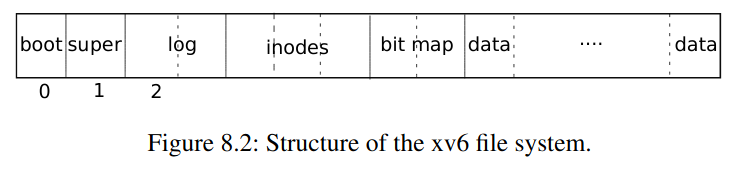
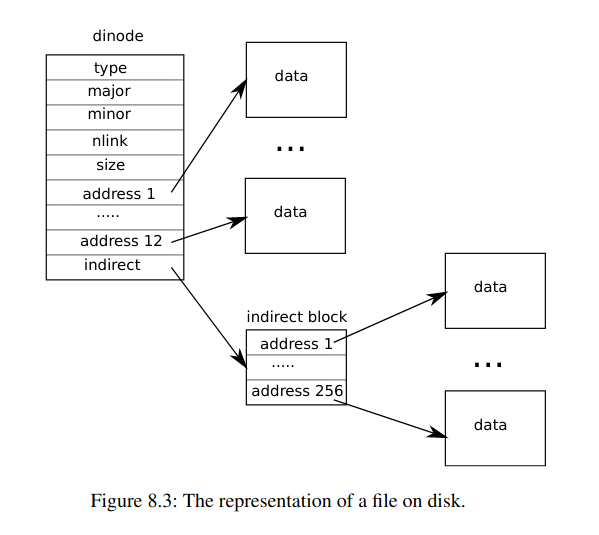

# File systems <!-- omit in toc -->

## Inhoudstafel <!-- omit in toc -->

- [Voorbereiding](#voorbereiding)
- [GitHub classroom](#github-classroom)
- [Introductie](#introductie)
- [Block device](#block-device)
- [Disk layout](#disk-layout)
  - [Superblock](#superblock)
- [Performantie](#performantie)
  - [Buffer cache](#buffer-cache)
- [Consistency](#consistency)
  - [Transaction log](#transaction-log)
- [Disk space management](#disk-space-management)
  - [Bitmap](#bitmap)
- [File tree](#file-tree)
  - [Disk Inodes](#disk-inodes)
  - [Memory inodes](#memory-inodes)
    - [Inode cache](#inode-cache)
    - [Bewerken inode](#bewerken-inode)
  - [Bestanden](#bestanden)
  - [Directory](#directory)
- [File descriptors](#file-descriptors)
  
## Voorbereiding

Ter voorbereiding van deze zitting worden jullie verwacht:

* De oefenzitting Synchronizatie te hebben voltoold
* Hoofdstuk 8 van het [xv6 boek](https://github.com/besturingssystemen/xv6-riscv) te hebben gelezen.

## GitHub classroom

<!-- TODO -->

## Introductie

Besturingssystemen werken met een geheugenhiërarchie.
Op het moment dat een OS actief is, zit er bijvoorbeeld code en data in het RAM, in caches en registers.
Al dit geheugen is echter vluchtig.
Wanneer je de stroom van de machine uittrekt, is al deze data plots weg.

Code en data die we willen bewaren voor een lange tijd, ook na het heropstarten van een machine, bewaren we op een opslagmedium.
Op dit opslagmedium staat de code van het Besturingssysteem, alle data, de bestanden die een gebruiker op zijn machine heeft staan, enzovoort.

Er zijn vele soorten opslagmediums, elk met hun eigen capaciteit, snelheid en eventueel andere voor- en nadelen.
Al deze mediums kunnen gekoppeld worden aan een computer.
Zo heb je [Hard disk drives](https://en.wikipedia.org/wiki/Hard_disk_drive), [Solid-state drives](https://en.wikipedia.org/wiki/Solid-state_drive), [USB flash drives](https://en.wikipedia.org/wiki/USB_flash_drive), [Floppy disk drives](https://en.wikipedia.org/wiki/Floppy_disk), enzovoort.
Dit soort apparaten worden ook welk [*mass storage devices*](https://en.wikipedia.org/wiki/Mass_storage) genoemd.

> :information_source: Bij het opstart van een PC zal typisch de [BIOS](https://en.wikipedia.org/wiki/BIOS) de opstartcode (boot loader) lezen uit een drive en in het RAM-geheugen plaatsen.
> Vanuit RAM kan de processor deze code uitvoeren.
> Deze boot loader zal het RAM geheugen van de machine initialiseren via een [bootstrap-proces](https://en.wikipedia.org/wiki/Bootstrapping).
> Gedurende dit proces kunnen er eventueel ook nog andere nodige delen van het OS uit de drive gelezen worden.

Elk van deze mediums maken het mogelijk grote hoeveelheden data te bewaren.
Deze data moet georganiseerd worden.
Er moet een manier zijn om te weten welke data bij welk bestand hoort.
Deze organisatie gebeurt met behulp van *file systems*.
File systems kunnen op [vele verschillende manieren](https://en.wikipedia.org/wiki/Comparison_of_file_systems) geïmplementeerd worden.
In deze zitting zullen we dieper ingaan op het custom file system van xv6.

## Block device

Elk van deze opslagmedia kunnen we opdelen in blokken vast vaste grootte.
De blokken kan je vervolgens elk een adres voorstellen.
De verschillende apparaten kunnen we dus abstract voorstellen als apparaten waarnaar je blokken geheugen kan lezen en schrijven.
Deze abstracte apparaten noemen we block devices.

xv6 neemt aan dat het file system bewaard wordt op zo'n block device.
De grootte van een blok is [in xv6 ingesteld op `BSIZE` bytes](block-size).
Het block device waarop xv6 zijn file system bewaart, en dat dus opgedeeld is in blokken van grootte `BSIZE`, wordt de *disk* genoemd.

> :information_source: Merk op dat deze *disk* een hard-drive, solid state drive, USB drive, ... zou kunnen zijn. In qemu emulator wordt een hard drive geëmuleerd op basis van een *image* file (`fs.img`). Deze image bevat de inhoud van de virtuele disk.

## Disk layout

We weten dus dat onze disk opgedeeld is in blokken van grootte `BSIZE`.
Welke data kan je terugvinden in welke blokken wordt vastgelegd in de disk layout.
Onderstaande afbeelding toont deze layout.

De allereerste blok van de disk, blok 0, wordt gebruikt om de *boot code* te bewaren.
We noemen dit de [boot sector](https://en.wikipedia.org/wiki/Boot_sector).
Het is conventie om de boot sector te bewaren in de allereerste blok van een mass storage device.
Deze conventie laat ons toe om andere boot loaders te installeren of om de boot loader te bewerken, om zo verschillende soorten besturingssystemen te op te kunnen starten op éénzelfde machine, vanuit verschillende soorten mass storage devices.
De boot sector is nog geen deel van het file system zelf.

> :information_source: Mass storage devices kunnen opgedeeld worden in verschillende partities, elk met hun eigen bootgedeelte. Op sector 0 vinden we in dat geval de [Master Boot Record](https://en.wikipedia.org/wiki/Master_boot_record), met informatie over de verschillende partities op die specifieke schijf. Indien een partitie een OS bevat zal deze partitie vervolgens een [Volume Boot Record](https://en.wikipedia.org/wiki/Volume_boot_record) hebben met daarin de boot code van het OS op die partitie. Wanneer de xv6 boek of deze oefenzitting spreekt over een disk, moet je dit voorstellen als een partitie, niet als de volledige harde schijf. De boot sector van xv6 zou dus in de VBR zitten van een gepartitioneerde schijf.

### Superblock

Blok 1 is de eerste blok van het filesystem zelf.
In xv6 wordt deze blok de superblock genoemd.
De superblock bevat meta-informatie over het filesystem.
Op basis van de superblock kan je de volledige disk layout van het file system achterhalen.

* Bekijk [`struct superblock`](superblock) in `kernel/fs.h`. Vergelijk met bovenstaande figuur waarin de lay-out van de disk wordt beschreven.

Het veld `magic` bevat een [magic number](https://en.wikipedia.org/wiki/Magic_number_(programming)), dat gebruikt wordt om het xv6 file system te identificeren. De magic number van het xv6 file system bestaat uit de bytes `0x40 0x30 0x20 0x10`, ofwel het getal `0x10203040` voorgesteld met de [little-endian](https://en.wikipedia.org/wiki/Endianness) byte order.
Magic numbers in bestanden en file systems worden gebruikt om de verschillende soorten van elkaar te onderscheiden. Zo start bevoorbeeld elk [ELF-bestand](https://en.wikipedia.org/wiki/Executable_and_Linkable_Format) met de bytes `0x7F 0x45 0x4c 0x46`, de magic number van ELF-files.

> **:question: Voer `make` uit in de xv6-repo. Voer vervolgens het commando `hd fs.img | head -4` uit. Het commando hex dump (`hd`) toont de inhoud van een bestand byte per byte. Kan je de magic number van xv6 terugvinden? Wat is het byte-adres van de eerste byte van deze magic number? Waarvan komt deze waarde?**

Het tweede veld `size` bevat de grootte, uitgedrukt in aantal blokken, van de volledige file system image.

> **:question: Voer nogmaals `hd fs.img | head -4` uit. Bereken de grootte in bytes van het file system op basis van het tweede veld `size`. Voer vervolgens `ls -l` uit en vergelijk met de grootte van `fs.img`.**
>
> :bulb: Het type `uint` is telkens 4 bytes groot, de waarden staan opgeslagen in [little-endian byte order](https://en.wikipedia.org/wiki/Endianness).

Vervolgens worden `nblocks`, `ninodes` en `nlog` bewaard, die respectievelijk het aantal data blokken, inodes en log blokken weergeven.
Ten slotte bevatten `logstart`, `inodestart` en `bmapstart` de blok-adressen waar de eerste blok van respectievelijk de `log`, de inodes en de `bitmap` secties.
We leggen in de komende secties uit wat de `log`, inodes en `bitmap` secties net voorstellen.

## Performantie

Lezen en schrijven naar mass storage kan erg traag zijn.
Indien je bijvoorbeeld gebruik maakt van een harde schijf, zal deze schijf eerst fysiek moeten roteren en eventueel van track verwisselen om de juiste sector te selecteren.
Dat kan allemaal lang duren.
Hoewel een Solid State Drive al een stuk sneller is, is een leesoperatie uit een SSD schijf nog steeds enkele grootte-ordes trager dan een leesoperatie uit RAM geheugen.

> :information_source: De tijd tussen een leesoperatie en het moment dat de data beschikbaar is vanuit RAM geheugen [wordt gemeten in nanoseconden](https://en.wikipedia.org/wiki/CAS_latency).
> Voor een SSD [wordt dit gemeten in microseconden](https://blocksandfiles.com/2020/09/08/seven-attempts-to-speed-processing-with-faster-storage/) (1 microseconde = 1000 nanoseconden). 
> Voor een HDD [gaat dit zelfs over miliseconden](https://en.wikipedia.org/wiki/Hard_disk_drive_performance_characteristics) (1 miliseconde = 1000 microseconden).

### Buffer cache

Om ervoor te zorgen dat lees- en schrijfoperaties naar bestanden veel sneller kunnen verlopen, maakt het file system van xv6 gebruik van een [*cache*](https://en.wikipedia.org/wiki/Cache_(computing)).
Wanneer een geheugenblok gelezen wordt, wordt deze geheugenblok in het RAM-geheugen geplaatst, in de *buffer cache*.
Vanaf dan kunnen alle lees- en schrijfoperaties rechtstreeks via het RAM-geheugen verlopen, in plaats van via de harde schijf.

De buffer cache wordt voorgesteld door een *doubly linked list* van buffers (gecachte blokken), gesorteerd zodat de *least recently used* buffer achteraan (`head->prev`) in de lijst staat en de *most recently used* buffer dus vooraan (`head->next`) staat.

* Bekijk de functie [`bget`][bget] in `kernel/bio.c`. Deze functie wordt gebruikt door [`bread`][bread] en [`bwrite`][bwrite] om een buffer overeenkomstig met een gegeven bloknummer op te vragen. Indien de blok niet gecacht is wordt er gezocht naar een ongebruikte buffer in de buffer cache en wordt deze buffer toegewezen aan een specifieke blok.
* Bekijk de functie [`bread`][bread] en [`bwrite`][bwrite]. `bread` vraagt aan `bget` een buffer voor een specifiek bloknummer. Indien deze buffer zonet door `bget` hergebruikt werd bevatte deze nog foute data van een andere blok (`b->valid == 0`), en wordt de juiste blokdata van de disk gelezen. `bwrite` zorgt ervoor dat de data in een buffer naar de correcte blok in de mass storage wordt geschreven.

Het gevolg van het invoeren van een cache laag is dat lees- en schrijfoperaties niet meer rechtstreeks naar de harde schijf worden gestuurd.
Pas wanneer buffers expliciet weggeschreven worden met `bwrite` is een aanpassing van de inhoud van een blok effectief bewaard in de long term storage.

## Consistency

### Transaction log

Een besturingssysteem kan op ieder moment crashen, ter gevolg van een fout in de code of gewoon door stroom die wegvalt.
Stel dat je echter besturingssysteemcode hebt die een gegevensstructuur aanpast op de disk, bijvoorbeeld code die een bestand uit het file system verwijderd, die bestaat uit meerdere schrijfoperaties.

Stel dat schrijfoperatie *Wa* het bestand uit de directorystructuur haalt, en schrijfoperatie *Wb* de gealloceerde file system blokken als ongebruikt markeert.
Indien enkel *Wa* uitgevoerd zou worden, zou een bestand dat niet in de directorystructuur zit nog steeds plaats innemen op de disk. Je zou dus een memory leak hebben.
Indien enkel *Wb* uitgevoerd zou worden, zou een bestand in de directory verwijzen naar niet-gealloceerde blokken uit het file system, die eventueel later aan een ander bestand zouden gekoppeld worden.

Sommige operaties bestaan uit verschillende schrijfoperaties, die allemaal uitgevoerd moeten worden, om te vermijden dat het file system in een inconsistente staat terecht komt.
xv6 lost deze uitdaging op door middel van [transacties](https://en.wikipedia.org/wiki/Transaction_processing).
Een transactie groepeert verschillende schrijfoperaties.
Er wordt gegarandeerd dat ofwel alle schrijfoperaties in een transactie uitgevoerd worden, ofwel geen enkele.
Dit wordt gegarandeerd via een *transaction log*.

Alle gegroepeerde schrijfoperaties in een transactie worden eerst geschreven naar een aparte regio van de disk, de log.
Wanneer alle schrijfoperaties binnen een transactie naar de log geschreven zijn, kan je zeker zijn dat zelfs wanneer op dat moment een crash voorvalt, de geschreven data nog steeds beschikbaar is.
Alles staat namelijk in de log op de disk.
Op dat moment zijn de geschreven blokken op de disk echter nog niet gewijzigd.

Wanneer alle schrijfoperaties in de log staan, kan de transactie *gecommit* worden.
De operaties kunnen vanuit de log naar de juiste plaats op de disk geschreven worden.
Een crash kan er hoogstens voor zorgen dat het kopiëren van de log naar de juiste disk sectoren onderbroken wordt.
Bij het opnieuw opstarten vanuit een crash, kunnen al deze schrijfoperaties echter gewoon opnieuw hervat worden, want ze staan nog steeds klaar in de log.
Er is dan geen data verloren gegaan.
Transacties garanderen dus dat alle schrijfoperaties in één transactie als een geheel worden uitgevoerd.

Indien de machine crashte op een moment dat de transactie nog niet volledig klaarstond in de log, wordt de transactie gewoon nooit uitgevoerd.
Op dat moment kan het namelijk zijn dat het committen van deze incomplete transactie ervoor zou zorgen dat het file system in een inconsistente state terecht komt.
Een transactie wordt dus ofwel in zijn volledigheid uitgevoerd, ofwel helemaal niet.

De functies [`begin_op`][begin_op] en [`end_op`][end_op] worden gebruikt om een transactie te starten en te beëindigen.
Je zal deze operaties terugvinden in verschillende system calls die gebruik maken van het file system.

> **:question: Bekijk de functie [`log_write`][log_write].
> Deze wordt gebruikt om een bewerkte buffer vanuit de cache naar de schijf te schrijven.
> De functie [`bwrite`][bwrite] wordt echter ook gebruikt om dezelfde reden.
> Wat is het verschil tussen deze functies?
> Wanneer gebruik je [`bwrite`][bwrite] en wanneer gebruik je [`log_write`][log_write]?
> De implementatie van [`write_log`][write_log] kan misschien verhelderend werken.**

## Disk space management

Herinner je dat de [`kalloc`][kalloc] en [`kfree`][kfree] functies gebruikt werden om fysiek geheugen te beheren.
Vrije frames worden in een gelinkte lijst bewaard, bij allocatie wordt een frame uit deze lijst gehaald en gealloceerd.

Zoals fysiek geheugen opgedeeld is in frames, zo wordt diskgeheugen opgedeeld in blokken.
Om blokken  diskgeheugen te alloceren hebben we gelijkaardige functies [`balloc`][balloc] en [`bfree`][bfree].

### Bitmap

`balloc` en `bfree` werken echter niet met een gelinkte lijst om vrije blokken te beheren.
In de plaats daarvan wordt een [*bitmap*](https://en.wikipedia.org/wiki/Bit_array) gebruikt.

De bitmap bestaat uit één (of meerdere) blokken geheugen op de disk.
Elke bit van deze blokken verwijst naar een specifieke diskblok.
Indien de bit van een blok in de bitmap `1` is, is de diskblok gealloceerd.
Indien de bit van een blok in de bitmap `0` is, is deze diskblok vrij om gebruikt te worden.

Om te kijken of een blok vrij is moet je dus kijken in de bitmap naar de bit die verwijst naar de blok geheugen.
Indien de bit `0` is, is de blok vrij.
Om de blok te alloceren moet je deze bit op `1` zetten.

> **:question: Waarom maakt xv6 gebruik van een bitmap voor `balloc` en een gelinkte lijst voor `kalloc`? Zou een bitmap voor `kalloc` ook mogelijk zijn? Zou een gelinkte lijst voor `balloc` mogelijk zijn? Kan je voor- of nadelen bedenken? Zou jij dezelfde keuze maken als xv6?**

## File tree

De voorgaande secties gingen telkens over het beheer van de disk.
Hoe schrijf je naar de disk, hoe lees je van de disk, hoe alloceer je blokken op de disk, ... .
Nu al deze vragen opgelost zijn kunnen we kijken naar de echte organisatie van bestanden op deze disk.
Hoe stel je bestanden voor?
Waar bewaar je deze bestanden?
Waar bewaar je de directories waarin deze bestanden zitten?
Dat zijn enkele van de vragen die we in deze sectie zullen beantwoorden.

Files in file systems worden typisch georganiseerd door middel van een [boomstructuur](https://en.wikipedia.org/wiki/Tree_(data_structure)) van directories (folders/mappen) en bestanden.
Elke directory kan ofwel subdirectories, ofwel bestanden bevatten.
De root directory (in UNIX-based systemen wordt deze directory `/` genoemd) is het startpunt, de buitenste folder.

In UNIX systemen worden bepaalde *device drivers* ook voorgesteld door middel van speciale bestanden in het file system.
Schrijfoperaties of leesoperaties naar deze bestanden worden doorgestuurd naar de overeenkomstige *driver*.
Zo is het eenvoudig om dezelfde I/O interface te gebruiken voor devices als voor files.
Dit zijn dus geen normale bestanden.
Ze worden vaak [device files](https://en.wikipedia.org/wiki/Device_file) of special files genoemd.

Elke *node* van de boomstructuur kan dus een bestand, directory, of een special file zijn.
Deze *nodes* worden in xv6 en andere UNIX-based file systems voorgesteld door [inodes](https://en.wikipedia.org/wiki/Inode).

### Disk Inodes

Een *inode* stelt abstract een node voor in de boomstructuur van het file system.
Op de disk worden alle inodes van een file system bewaard.

Deze worden in xv6 voorgesteld door een [`struct dinode`][dinode] (disk inode).
Een `struct dinode` heeft een `type`, dat kan verwijzen naar een bestand, directory of special file.
De grootte in bytes van een bestand wordt bewaard in `size`.
De inhoud van het bestand wordt bewaard op één of meerdere blokken van de disk.

De `addrs` array bevat de disk addressen van verschillende diskblokken.
De addressen in deze array bevatten allen een deel van het bestand.
De grootte van deze array is `NDIRECT + 1`.
Er zijn dus `NDIRECT` mogelijke disk blokken die data van het bestand kunnen bevatten.
Een bestand kan dus grootte `NDIRECT * BSIZE` hebben.

Op locatie `addrs[NDIRECT]` bevindt zich echter nog een speciale disk blok.
Op deze disk blok staan nog eens `NINDIRECT` verschillende disk adressen.
Ook deze `NINDIRECT` blokken kunnen data van het bestand bevatten.
Een bestand kan dus `(NDIRECT + NINDIRECT) * BSIZE)` blokken hebben.
De eerste `NDIRECT` blokken kan je terugvinden in de `struct dinode`, de laatste `NINDIRECT` blokken in de blok op adres `addrs[NDIRECT]`.

> **:question: Wat is de maximale bestandsgrootte in xv6? Hoe zou je xv6 kunnen aanpassen om bestanden van arbitraire grootte toe te laten?**

<!-- TODO oefening die grotere bestanden toelaat -->

<!-- TODO andere velden bestpreken (nlink, minor, major) -->

### Memory inodes

Een [`struct dinode`][dinode] is de on-disk representatie van een inode.
Wanneer we een dinode willen bewerken, zullen we deze in-memory voorstellen met behulp van de [`struct inode`][inode].
De in-memory representatie heeft extra velden, die niet permanent op een disk bewaard moeten worden.

> :information_source: Wanneer we vanaf nu spreken over dinode bedoelen we de specifieke on-disk representatie van een inode.
> Een dinode is dus een structuur op een bepaalde disk.
> Een inode is de in-memory kopie.
> Het is mogelijk dat er meerdere disks zijn, met meerdere on-disk file systems, elk met hun eigen dinodes.
> inodes kunnen dus naar dinodes van verschillende disks verwijzen.

<!--- Het veld `dev` geeft aan op welke block device de in-memory inode opgeslagen is.
Indien je meerdere disks hebt is het belangrijk bij te houden op welke disk de overeenkomstige dinode bewaard werd. -->

Een on-disk xv6 filesystem bevat een vast aantal dinodes.
Dit aantal wordt bewaard in de superblock `sb` in het veld `sb->ninodes`.
Deze dinodes bevinden zich in een array op de disk, startend van blok `sb->inodestart`.

Een unieke inode wordt geïdentificeerd door het paar (`dev`, `inum`).
De waarde `dev` is de id van een block device (bvb een disk), `inum` is de index in de dinode-array van dat block device.
Voor een specifieke [`struct inode`][inode] identificeren de velden `dev` en `inum` dus samen de exacte blok op de gegeven disk/block device waar de overeenkomstige dinode bewaard is.

Om een nieuwe inode aan te maken op een block device `dev`, wordt gebruik gemaakt van de functie [`ialloc`][ialloc].
Deze functie kijkt of er nog niet-gealloceerde dinodes (`dinode->type == 0`) beschikbaar zijn op de disk.
Indien een niet-gealloceerde dinode gevonden wordt, wordt deze geïnitialiseerd met het gegeven type.

> **:question: Waarom moet [`ialloc`][ialloc] geen gebruik maken van [`balloc`][balloc] om een nieuwe inode aan te maken?**

#### Inode cache

Pointers naar actieve inodes (*in xv6-code: `ip` of inode pointer*) worden in-memory bewaard in een array genaamd de inode cache (`icache`).
De functie [`iget`][iget] kijkt of een specifieke dinode reeds in de cache aanwezig is.
Zo ja, wordt de bestaande inode pointer teruggegeven.
Zo niet, wordt een ongebruikte inode pointer (`ip->ref == 0`) gereturned.

<!-- TODO Waarom is de inode cache een fixed size array??
Zou het voor meerdere disks niet logischer zijn om een linked list te maken? Lijkt me een artificiële limitatie -->

Het veld `ip->valid` geeft aan of de inode reeds gelezen is van de disk.
De functie `iget` returnt namelijk enkel een inode pointer uit de cache,
maar garandeert niet dat de inode reeds de informatie van de overeenkomstige dinode heeft uitgelezen.

De functie [`ilock`][ilock] moet gebruikt worden om een lock te verkrijgen vooraleer er gelezen of geschreven mag worden naar een inode.
[`ilock`][ilock] zal, naast het verkrijgen van een lock, ook controleren of een inode al dan niet valid (gelezen van disk) is.
Indien dit niet het geval is, zal hier de data van de dinode uitgelezen worden met behulp van [`bread`][bread].

Het is mogelijk dat dezelfde inode pointer uit de inode cache door meerdere stukken code in gebruik is op hetzelfde moment.
Het veld `inode->ref` bewaart het aantal open referenties naar een specifieke inode.
Wanneer een inode opgevraagd wordt met `iget` wordt deze waarde verhoogd met 1.
Op het moment dat een stuk code een inode niet meer nodig heeft, wordt [`iput`][iput] opgeroepen.
In `iput` wordt `inode->ref` verlaagd met 1.
Indien de laatste referentie via `iput` wordt vrijgegeven, wordt de inode pointer terug vrijgemaakt in de cache zodat deze hergebruikt kan worden om te verwijzen naar een andere dinode.

#### Bewerken inode

Via een inode pointer kan de inhoud van een inode bewerkt worden.
Met behulp van [itrunc][itrunc] wordt de inhoud van een bepaalde inode volledig gewist.
[stati][stati] wordt gebruikt om de meta-informatie van een inode op te vragen.
[readi][readi] en [writei][writei] worden gebruikt om respectievelijk te lezen en schrijven naar de datablokken van een inode.

> **:question: Bekijk de code van [`readi`][readi] en [`writei`][writei] aandachtig en probeer te begrijpen hoe deze functies werken.
> Zal een `writei`-operatie meteen naar de disk schrijven?
> Zo niet, wanneer wordt de geschreven informatie dan wel effectief naar de disk geschreven?**

### Bestanden

Een bestand is een inode met het type `T_FILE`.
De data van een bestand wordt bewaard in de blok(ken) van de inode.

### Directory

Een directory (folder) is een inode met het type `T_DIR`.
De data van een directory inode bevat een array van *directory entries*.
Elke entry bevat een naam en verwijst naar een inode op hetzelfde block device.
De entries kunnen dus bestanden zijn, device files/special files of andere folders.
Een directory entry wordt voorgesteld door een [`struct dirent`][dirent].

> **:question: Stel dat je een directory hebt met exact 1 gealloceerde disk block in de inode. Wat is het maximaal aantal directory entries dat deze directory kan bevatten?**

> **:question: Wat is het effectieve maximale aantal entries dat een directory in xv6 kan bevatten?**

De functie [`dirlookup`][dirlookup] zoekt een directory entry in een gegeven directory.
Dit gebeurt door met `readi` de inhoud van de directory inode te lezen, entry per entry, tot de gezochte naam teruggevonden wordt.
Het resultaat is de inode waarnaar de directory entry verwijst.
Met [`dirlink`][dirlink] voeg je een inode toe aan een directory.
Elke directory heeft standaard de entry `.`, verwijzend naar zichzelf, en de entry `..`, verwijzend naar de parent directory inode.

Absolute paden in directories worden in UNIX voorgesteld als volgt:
`/dirx/diry/dirz/filename`.
De directory `/` is de root directory, met subdirectory `dirx`.
`dirx` heeft als subdirectory `diry`, enzovoort.
Relatieve paden zijn paden die niet starten met `/` en worden relatief van de huidige *working directory* geresolved.

De functie [`namex`][namex] neemt een absoluut of relatief pad en geeft als resultaat de inode terug waarnaar dit pad verwijst.

<!-- TODO mogelijke oefening: langere pathnames -->
<!-- TODO directory boommstructuur uitwerken -->

## File descriptors

<!-- TODO file descriptors uitleggen -->

<!-- TODO dinode vs inode verwarring anders aanpakken -->

[block_size]:https://github.com/besturingssystemen/xv6-riscv/blob/02ca399d0590a57d9ba05fcf556546141a5e2a09/kernel/fs.h#L11
[superblock]:https://github.com/besturingssystemen/xv6-riscv/blob/02ca399d0590a57d9ba05fcf556546141a5e2a09/kernel/fs.h#L19
[bget]:https://github.com/besturingssystemen/xv6-riscv/blob/028af2764622d489583cd88935cd1d2a7fbe8248/kernel/bio.c#L55
[bread]:https://github.com/besturingssystemen/xv6-riscv/blob/028af2764622d489583cd88935cd1d2a7fbe8248/kernel/bio.c#L91
[bwrite]:https://github.com/besturingssystemen/xv6-riscv/blob/028af2764622d489583cd88935cd1d2a7fbe8248/kernel/bio.c#L105
[begin_op]:https://github.com/besturingssystemen/xv6-riscv/blob/2501560cd691fcdb9c310dccc14ac4e7486c99d9/kernel/fs.c#L125
[end_op]:https://github.com/besturingssystemen/xv6-riscv/blob/2501560cd691fcdb9c310dccc14ac4e7486c99d9/kernel/fs.c#L144
[log_write]:https://github.com/besturingssystemen/xv6-riscv/blob/2501560cd691fcdb9c310dccc14ac4e7486c99d9/kernel/fs.c#L205
[write_log]:https://github.com/besturingssystemen/xv6-riscv/blob/2501560cd691fcdb9c310dccc14ac4e7486c99d9/kernel/fs.c#L177
[kalloc]: https://github.com/besturingssystemen/xv6-riscv/blob/85bfd9e71f6d0dc951ebd602e868880dedbe1688/kernel/kalloc.c#L65
[kfree]: https://github.com/besturingssystemen/xv6-riscv/blob/85bfd9e71f6d0dc951ebd602e868880dedbe1688/kernel/kalloc.c#L42
[balloc]: https://github.com/besturingssystemen/xv6-riscv/blob/675060882480c21915629750a5a504d9da445ba3/kernel/fs.c#L63
[bfree]: https://github.com/besturingssystemen/xv6-riscv/blob/675060882480c21915629750a5a504d9da445ba3/kernel/fs.c#L89
[dinode]:https://github.com/besturingssystemen/xv6-riscv/blob/02ca399d0590a57d9ba05fcf556546141a5e2a09/kernel/fs.h#L36
[inode]:https://github.com/besturingssystemen/xv6-riscv/blob/2b5934300a404514ee8bb2f91731cd7ec17ea61c/kernel/file.h#L23

[ialloc]: https://github.com/besturingssystemen/xv6-riscv/blob/675060882480c21915629750a5a504d9da445ba3/kernel/fs.c#L192
[iput]: https://github.com/besturingssystemen/xv6-riscv/blob/675060882480c21915629750a5a504d9da445ba3/kernel/fs.c#L325
[iget]: https://github.com/besturingssystemen/xv6-riscv/blob/675060882480c21915629750a5a504d9da445ba3/kernel/fs.c#L239
[ilock]: https://github.com/besturingssystemen/xv6-riscv/blob/675060882480c21915629750a5a504d9da445ba3/kernel/fs.c#L286

[itrunc]: https://github.com/besturingssystemen/xv6-riscv/blob/675060882480c21915629750a5a504d9da445ba3/kernel/fs.c#L407
[stati]: https://github.com/besturingssystemen/xv6-riscv/blob/675060882480c21915629750a5a504d9da445ba3/kernel/fs.c#L439
[readi]: https://github.com/besturingssystemen/xv6-riscv/blob/675060882480c21915629750a5a504d9da445ba3/kernel/fs.c#L451
[writei]: https://github.com/besturingssystemen/xv6-riscv/blob/675060882480c21915629750a5a504d9da445ba3/kernel/fs.c#L479

[dirent]: https://github.com/besturingssystemen/xv6-riscv/blob/02ca399d0590a57d9ba05fcf556546141a5e2a09/kernel/fs.h#L61
[dirlookup]: https://github.com/besturingssystemen/xv6-riscv/blob/675060882480c21915629750a5a504d9da445ba3/kernel/fs.c#L526
[dirlink]: https://github.com/besturingssystemen/xv6-riscv/blob/675060882480c21915629750a5a504d9da445ba3/kernel/fs.c#L554
[namex]: https://github.com/besturingssystemen/xv6-riscv/blob/675060882480c21915629750a5a504d9da445ba3/kernel/fs.c#L623